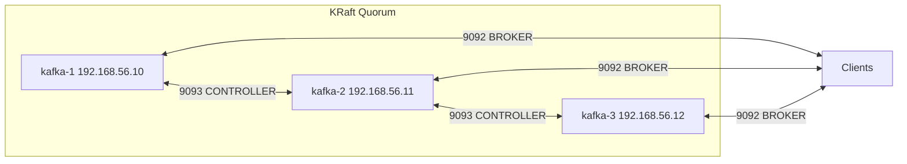

# Apache Kafka KRaft Cluster on Vagrant + KVM/libvirt (Manual, 3 Nodes)

> **Goal:** Vagrant (**libvirt provider**) ব্যবহার করে ৩টি Ubuntu VM-এ **Apache Kafka 4.0.0 (KRaft mode)** ক্লাস্টার ম্যানুয়ালি সেটআপ করা।  
> **IPs:** `192.168.56.10`, `192.168.56.11`, `192.168.56.12`  
> **Provisioner:** None (সবকিছু হাতে করবেন).

---

## Table of Contents
- [Prerequisites](#prerequisites)
- [Architecture](#architecture)
- [Step 0: Prepare libvirt Network](#step-0-prepare-libvirt-network)
- [Step 1: Create Vagrantfile and Boot VMs](#step-1-create-vagrantfile-and-boot-vms)
- [Step 2: OS and Java on Each VM](#step-2-os-and-java-on-each-vm)
- [Step 3: Install Kafka on Each VM](#step-3-install-kafka-on-each-vm)
- [Step 4: Configure Kafka (KRaft)](#step-4-configure-kafka-kraft)
- [Step 5: Generate Cluster UUID & Format Storage](#step-5-generate-cluster-uuid--format-storage)
- [Step 6: Create systemd Service](#step-6-create-systemd-service)
- [Step 7: Verify the Cluster](#step-7-verify-the-cluster)
- [Step 8: Create Topic and Test](#step-8-create-topic-and-test)
- [Troubleshooting (libvirt + Kafka)](#troubleshooting-libvirt--kafka)
- [Ops Cheatsheet](#ops-cheatsheet)
- [Design Rationale](#design-rationale)
- [Cluster Failure Test](#cluster-failure-test)

---

## Prerequisites

**Why:** `KVM/libvirt` + `Vagrant` দিয়ে stable VM orchestration দরকার, আর `Kafka` চালাতে `Java` runtime লাগে।  
**What:** হোস্ট মেশিনে নিচের জিনিসগুলো প্রস্তুত রাখুন (Linux host recommended)।  
**How:** এই কমান্ডগুলো দিয়ে যাচাই/ইনস্টল করবেন।

```bash
# CPU virtualization support (vmx/svm)
egrep -c '(vmx|svm)' /proc/cpuinfo  # >=1 হলে ঠিক আছে

# libvirt daemon সক্রিয়
sudo systemctl enable --now libvirtd
sudo systemctl status libvirtd

# Vagrant + libvirt plugin
vagrant plugin install vagrant-libvirt

# প্রয়োজনীয় প্যাকেজ (host)
sudo apt update
sudo apt install -y qemu-kvm libvirt-daemon-system libvirt-clients bridge-utils virt-manager \
                   libxslt-dev libxml2-dev libvirt-dev zlib1g-dev ruby-dev

# গ্রুপ মেম্বারশিপ (logout/login বা newgrp দরকার)
sudo usermod -aG libvirt,kvm $USER
newgrp libvirt

# যাচাই
virsh list --all
```

**Expected:** কোনো এরর ছাড়া complete; `virsh list --all` খালি থাকতে পারে।

---

## Architecture

**Why:** ৩-node KRaft quorum দিলে **ZooKeeper** ছাড়াই metadata consensus হয়।  
**What:** প্রতিটি node একই `Kafka` binary/config schema, ভিন্ন `node.id` এবং `advertised.listeners`।

| Node    | IP              | Role                  | Ports                        |
|---------|------------------|-----------------------|------------------------------|
| kafka-1 | 192.168.56.10    | Broker + Controller   | 9092 (Broker), 9093 (Controller) |
| kafka-2 | 192.168.56.11    | Broker + Controller   | 9092, 9093                   |
| kafka-3 | 192.168.56.12    | Broker + Controller   | 9092, 9093                   |



---

## Step 0: Prepare libvirt Network

**Why:** default libvirt network সাধারণত `192.168.121.0/24`; আমরা static IP চাই `192.168.56.0/24` এ।  
**What:** `kafka-net` নামে NAT network define করবো যাতে host→guest reachability থাকে।  
**How:** XML create → `virsh net-define` → autostart + start।

Create `kafka-net.xml`:
```xml
<network>
  <name>kafka-net</name>
  <forward mode='nat'/>
  <bridge name='virbr56' stp='on' delay='0'/>
  <ip address='192.168.56.1' netmask='255.255.255.0'>
    <dhcp>
      <range start='192.168.56.100' end='192.168.56.200'/>
    </dhcp>
  </ip>
</network>
```

Commands:
```bash
sudo virsh net-define kafka-net.xml
sudo virsh net-autostart kafka-net
sudo virsh net-start kafka-net
virsh net-list --all
```

**Expected:**
```
Name        State    Autostart   Persistent
-------------------------------------------
default     active   yes         yes
kafka-net   active   yes         yes
```

> Note: আমরা static IP নেব `.10/.11/.12`, যা DHCP range-এর বাইরে, conflict হবে না।

---

## Step 1: Create Vagrantfile and Boot VMs

**Why:** infra-as-code দিয়ে এক কমান্ডে ৩টি VM উঠবে এবং একই কনফিগ শেয়ার করবে।  
**What:** `Vagrantfile` এ `libvirt` provider, `hostname`, `static IP`, `CPU/RAM`।  
**How:** প্রজেক্ট ফোল্ডারে `Vagrantfile` সেভ করে `vagrant up --provider=libvirt` রান।

`Vagrantfile`:
```ruby
# Vagrantfile (libvirt provider)
Vagrant.configure("2") do |config|
  # তোমার ব্যবহৃত বক্স
  config.vm.box = "bento/ubuntu-24.04"
  config.vm.boot_timeout = 600

  nodes = {
    1 => { name: "kafka-1", ip: "192.168.56.10" },
    2 => { name: "kafka-2", ip: "192.168.56.11" },
    3 => { name: "kafka-3", ip: "192.168.56.12" }
  }

  nodes.each do |id, meta|
    config.vm.define meta[:name] do |node|
      node.vm.hostname = meta[:name]

      node.vm.provider :libvirt do |lv|
        lv.cpus = 2
        lv.memory = 2048
        # network আগে Step 0-এ তৈরি
      end

      node.vm.network :private_network,
        ip: meta[:ip],
        libvirt__network_name: "kafka-net"

      # synced_folder disable (তোমার শেয়ার করা কনফিগ অনুযায়ী)
      node.vm.synced_folder ".", "/vagrant", disabled: true
    end
  end
end
```

Boot:
```bash
vagrant up --provider=libvirt --no-parallel
vagrant status
```

Login:
```bash
vagrant ssh kafka-1
```

---

## Step 2: OS and Java on Each VM

**Why:** `Kafka` চালাতে `Java` দরকার এবং node discovery-র জন্য name resolution দরকার।  
**What:** `/etc/hosts` আপডেট + `OpenJDK 21` ইন্সটল।  
**How:** প্রতিটি VM-এ নিচের কমান্ড চালান।

```bash
# /etc/hosts
echo "192.168.56.10 kafka-1
192.168.56.11 kafka-2
192.168.56.12 kafka-3" | sudo tee -a /etc/hosts

# Update + Java
sudo apt update
sudo apt install -y openjdk-21-jdk
java -version
```

**Expected:**
```
openjdk version "21.0.x" ...
```

---

## Step 3: Install Kafka on Each VM

**Why:** সব node-এ একই `Kafka` version থাকা জরুরি।  
**What:** `kafka` system user, প্রয়োজনীয় directories, `Kafka 4.0.0` binary।  
**How:** ম্যানুয়ালি download + extract।

```bash
# user + dirs
sudo useradd -r -m -d /var/lib/kafka -s /usr/sbin/nologin kafka || true
sudo mkdir -p /opt/kafka /var/lib/kafka/{data,meta,logs}
sudo chown -R kafka:kafka /opt/kafka /var/lib/kafka

# download & install (Kafka 4.0.0)
cd /tmp
curl -LO https://downloads.apache.org/kafka/4.0.0/kafka_2.13-4.0.0.tgz
sudo tar -xzf kafka_2.13-4.0.0.tgz -C /opt/kafka --strip-components=1
sudo chown -R kafka:kafka /opt/kafka

# config dir
sudo mkdir -p /etc/kafka
sudo chown -R kafka:kafka /etc/kafka
```

---

## Step 4: Configure Kafka (KRaft)

**Why:** `KRaft` এ metadata quorum গঠনে সব node একই cluster-এ যুক্ত হয়, কিন্তু `node.id` ও `advertised.listeners` node-ভেদে আলাদা।  
**What:** নিচের `server.properties` ফাইলগুলো node অনুযায়ী apply করবেন।  
**How:** প্রতিটি node-এ `/etc/kafka/server.properties` লিখুন।

### kafka-1 `/etc/kafka/server.properties`
```properties
node.id=1
process.roles=broker,controller

controller.listener.names=CONTROLLER
listeners=BROKER://0.0.0.0:9092,CONTROLLER://0.0.0.0:9093
listener.security.protocol.map=BROKER:PLAINTEXT,CONTROLLER:PLAINTEXT
inter.broker.listener.name=BROKER
advertised.listeners=BROKER://kafka-1:9092

controller.quorum.voters=1@kafka-1:9093,2@kafka-2:9093,3@kafka-3:9093

log.dirs=/var/lib/kafka/data
metadata.log.dir=/var/lib/kafka/meta

num.partitions=3
offsets.topic.replication.factor=3
transaction.state.log.replication.factor=3
transaction.state.log.min.isr=2
group.initial.rebalance.delay.ms=0
auto.create.topics.enable=false
```

### kafka-2
```properties
node.id=2
process.roles=broker,controller

controller.listener.names=CONTROLLER
listeners=BROKER://0.0.0.0:9092,CONTROLLER://0.0.0.0:9093
listener.security.protocol.map=BROKER:PLAINTEXT,CONTROLLER:PLAINTEXT
inter.broker.listener.name=BROKER
advertised.listeners=BROKER://kafka-2:9092

controller.quorum.voters=1@kafka-1:9093,2@kafka-2:9093,3@kafka-3:9093

log.dirs=/var/lib/kafka/data
metadata.log.dir=/var/lib/kafka/meta

num.partitions=3
offsets.topic.replication.factor=3
transaction.state.log.replication.factor=3
transaction.state.log.min.isr=2
group.initial.rebalance.delay.ms=0
auto.create.topics.enable=false
```

### kafka-3
```properties
node.id=3
process.roles=broker,controller

controller.listener.names=CONTROLLER
listeners=BROKER://0.0.0.0:9092,CONTROLLER://0.0.0.0:9093
listener.security.protocol.map=BROKER:PLAINTEXT,CONTROLLER:PLAINTEXT
inter.broker.listener.name=BROKER
advertised.listeners=BROKER://kafka-3:9092

controller.quorum.voters=1@kafka-1:9093,2@kafka-2:9093,3@kafka-3:9093

log.dirs=/var/lib/kafka/data
metadata.log.dir=/var/lib/kafka/meta

num.partitions=3
offsets.topic.replication.factor=3
transaction.state.log.replication.factor=3
transaction.state.log.min.isr=2
group.initial.rebalance.delay.ms=0
auto.create.topics.enable=false
```

Quick check:
```bash
grep -E 'node.id|advertised.listeners|controller.quorum.voters' /etc/kafka/server.properties
```

---

## Step 5: Generate Cluster UUID & Format Storage

**Why:** একই `ClusterId` না হলে nodes এক cluster-এ join করবে না।  
**What:** এক node-এ `UUID` জেনারেট; তারপর সব node-এ একই `UUID` দিয়ে format।  
**How:** `kafka-storage.sh` ব্যবহার করুন।

Generate (one-time on any one node, e.g. kafka-1):
```bash
sudo -u kafka /opt/kafka/bin/kafka-storage.sh random-uuid
# Example output: gd2xrYtZSMyebJWp8r9XqQ
```

Format on all nodes (use the same UUID):
```bash
# এক লাইনে চালানো নিরাপদ (copy/paste glitch এড়াতে)
sudo -u kafka /opt/kafka/bin/kafka-storage.sh format -t gd2xrYtZSMyebJWp8r9XqQ -c /etc/kafka/server.properties
```

**Expected:**
```
Formatting metadata directory /var/lib/kafka/meta with metadata.version 4.0-IV3.
Formatting data directory /var/lib/kafka/data with metadata.version 4.0-IV3.
```

> Note: দ্বিতীয়বার চালালে দেখাবে `Log directory ... is already formatted.` পুনরায় ফরম্যাট দরকার হলে `--ignore-formatted` ব্যবহার করুন।

---

## Step 6: Create systemd Service

**Why:** service management, auto-restart, logging।  
**What:** `/etc/systemd/system/kafka.service`।  
**How:** unit তৈরি → daemon-reload → enable + start।

```ini
# /etc/systemd/system/kafka.service
[Unit]
Description=Apache Kafka (KRaft)
After=network-online.target
Wants=network-online.target

[Service]
User=kafka
Group=kafka
Environment=KAFKA_HEAP_OPTS=-Xms1g -Xmx1g
Environment=KAFKA_OPTS=
ExecStart=/opt/kafka/bin/kafka-server-start.sh /etc/kafka/server.properties
ExecStop=/opt/kafka/bin/kafka-server-stop.sh
Restart=on-failure
RestartSec=5
LimitNOFILE=100000
WorkingDirectory=/opt/kafka

[Install]
WantedBy=multi-user.target
```

Enable + start:
```bash
sudo systemctl daemon-reload
sudo systemctl enable --now kafka
sudo systemctl status kafka --no-pager
sudo journalctl -u kafka -f
```

---

## Step 7: Verify the Cluster

**Why:** controllers/brokers healthy কিনা নিশ্চিত হওয়া।  
**How:** যেকোনো node থেকে CLI চালান।

```bash
/opt/kafka/bin/kafka-metadata-quorum.sh --bootstrap-server kafka-1:9092 describe --status
```

Expected:
```
ClusterId:              gd2xrYtZSMyebJWp8r9XqQ
CurrentVoters:          [1, 2, 3]
```

```bash
/opt/kafka/bin/kafka-broker-api-versions.sh --bootstrap-server kafka-1:9092,kafka-2:9092,kafka-3:9092
```

---

## Step 8: Create Topic and Test

Create:
```bash
/opt/kafka/bin/kafka-topics.sh --create --topic test-topic --bootstrap-server kafka-1:9092 --partitions 3 --replication-factor 3
```

List/Describe:
```bash
/opt/kafka/bin/kafka-topics.sh --bootstrap-server kafka-1:9092 --list
/opt/kafka/bin/kafka-topics.sh --describe --topic test-topic --bootstrap-server kafka-1:9092
```

Produce (from kafka-3 for example):
```bash
/opt/kafka/bin/kafka-console-producer.sh --topic test-topic --bootstrap-server kafka-1:9092
>Hello Kafka Cluster!
>This is message number 2
```

Consume (from kafka-2):
```bash
/opt/kafka/bin/kafka-console-consumer.sh --topic test-topic --bootstrap-server kafka-2:9092 --from-beginning
```

Delete (optional):
```bash
/opt/kafka/bin/kafka-topics.sh --delete --topic test-topic --bootstrap-server kafka-1:9092
```

> Tip: producer prompt-এ `>` দেখাবে। প্রতিটি লাইনে Enter দিলে message publish হবে।

---

## Troubleshooting (libvirt + Kafka)

| Symptom | Why | Fix |
|---|---|---|
| `-bash: Formatting: command not found` | কপি-পেস্টে line continuation glitch, আউটপুটকে শেল কমান্ড ধরে নিয়েছে | `format` এক লাইনে চালান। |
| `kafka.service` not running | Heap/port conflict | `journalctl -u kafka -n 200 -f`; `lsof -i :9092,:9093`; `KAFKA_HEAP_OPTS` কমান। |
| Node missing from quorum | Name resolution/port 9093 issue | `/etc/hosts` ঠিক; `telnet kafka-2 9093`; firewall rules। |
| `Log directory has not been formatted` | UUID mismatch | Stop service → `/var/lib/kafka/{data,meta}/*` clear → একই UUID-এ `format` → start। |
| Vagrant IP না আসা | Wrong network attachment | `virsh net-list`; নিশ্চিত করুন network `kafka-net`; Vagrantfile-এ `libvirt__network_name` সঠিক। |
| `qemu closed monitor` during boot | Nested virt/permissions | `/dev/kvm` perms, user `kvm/libvirt` group, BIOS virtualization enabled। |

---

## Ops Cheatsheet

```bash
# Service
sudo systemctl {start|stop|restart|status} kafka
sudo journalctl -u kafka -f

# Cluster
/opt/kafka/bin/kafka-metadata-quorum.sh --bootstrap-server kafka-1:9092 describe --status
/opt/kafka/bin/kafka-broker-api-versions.sh --bootstrap-server kafka-1:9092,kafka-2:9092,kafka-3:9092

# Topics
/opt/kafka/bin/kafka-topics.sh --bootstrap-server kafka-1:9092 --list
/opt/kafka/bin/kafka-topics.sh --bootstrap-server kafka-1:9092 --delete --topic test-topic

# Consumer Groups
/opt/kafka/bin/kafka-consumer-groups.sh --bootstrap-server kafka-1:9092 --list
/opt/kafka/bin/kafka-consumer-groups.sh --bootstrap-server kafka-1:9092 --group my-group --describe
```

---

## Design Rationale

- **KRaft:** ZooKeeper dependency সরিয়ে ops সিম্পল।  
- **3 nodes:** quorum safety, `replication.factor=3`, `min.insync.replicas=2` প্রড-ইশ সেফটি দেয়।  
- **libvirt custom network:** static IP নিশ্চিত, host→guest connectivity সহজ।  
- **Manual steps:** learning-first; পরে চাইলে provisioning যোগ করা যাবে।

> Next: প্রড হার্ডেনিংয়ের জন্য `SSL`/`SASL` সক্ষম করুন, `JMX` metrics exporter যোগ করুন, OS tuning (`nofile`, `sysctl`) কনফিগার করুন।
---


## Step 9: Cluster Failure Test

**Why:** verify leader election and cluster resilience when a broker goes down.
**What:** stop one Kafka broker (VM), check cluster status, then restart it.
**How:** use `systemctl` inside the VM or `vagrant halt` from host.

---

### 9.1. Stop one VM (simulate broker failure)

From host machine:

```bash
vagrant halt kafka-1
```

Or inside VM:

```bash
sudo systemctl stop kafka
```

That node will drop out of the cluster.

---

### 9.2. Check cluster metadata

From another healthy broker:

```bash
/opt/kafka/bin/kafka-metadata-quorum.sh --bootstrap-server kafka-2:9092 describe --status
```

**Output shows:**

* `ClusterId` (unchanged)
* `CurrentVoters` (remaining brokers)
* `LeaderId` (controller leader after re-election)

Example:

```
ClusterId: gd2xrYtZSMyebJWp8r9XqQ
LeaderId: 2
LeaderEpoch: 5
CurrentVoters: [1, 2, 3]
```

---

### 9.3. Check topic leadership

```bash
/opt/kafka/bin/kafka-topics.sh --describe --topic test-topic --bootstrap-server kafka-2:9092
```

Example:

```
Partition: 0 Leader: 2 Replicas: 1,2,3 Isr: 2,3
```

This means broker 2 became leader for partition 0, and ISR shrunk to the live brokers.

---

### 9.4. Restart the node

Bring the broker back:

```bash
vagrant up kafka-1
# or
sudo systemctl start kafka
```

Verify service status:

```bash
sudo systemctl status kafka
```

You should see it active again:

```
● kafka.service - Apache Kafka (KRaft)
     Active: active (running) since ...
   Main PID: 8797 (java)
```

---

### 9.5. Observe new leader election

Run again:

```bash
/opt/kafka/bin/kafka-metadata-quorum.sh --bootstrap-server kafka-2:9092 describe --status
```

You’ll notice `LeaderId` shifting between brokers (`1`, `2`, `3`) as controllers re-elect when nodes leave/join.

---

### Notes

* Losing **one broker** in a 3-node cluster is fine (quorum = 2).
* Losing **two brokers** → quorum lost, cluster cannot make progress.
* Log messages like `Ignored unloading metadata for __consumer_offsets-...` are normal during restarts.

---

Want me to regenerate your **full README file** (with this Step 9: Test section merged in) so you can download it like before?
