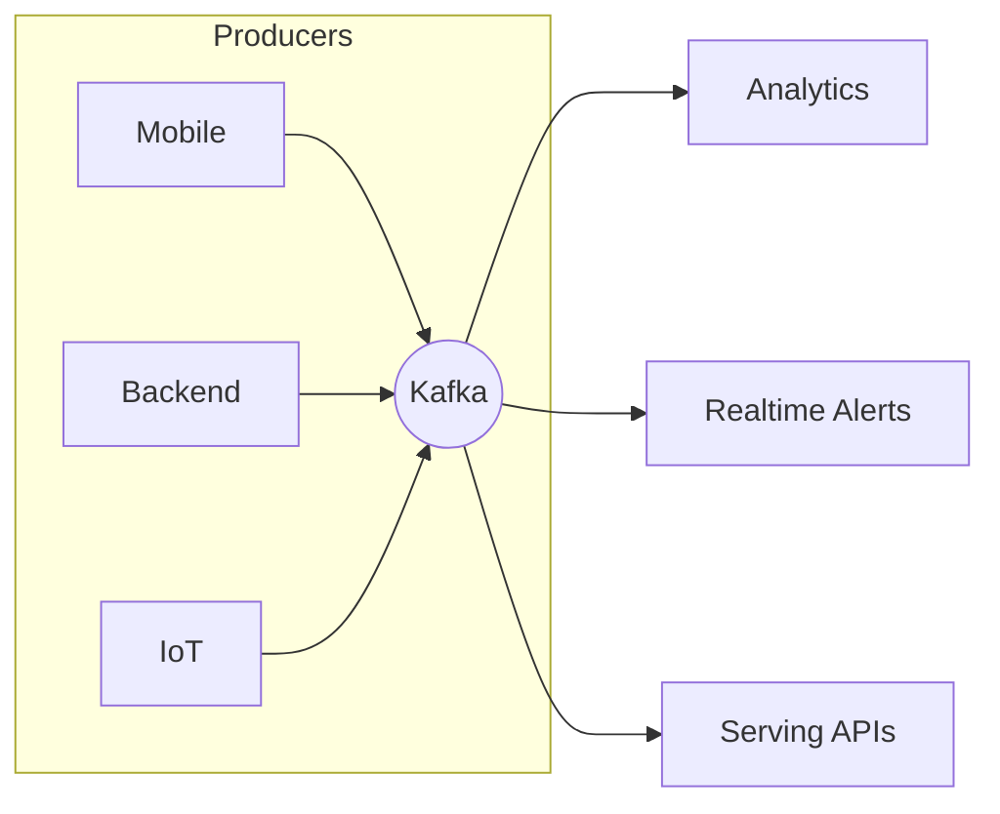
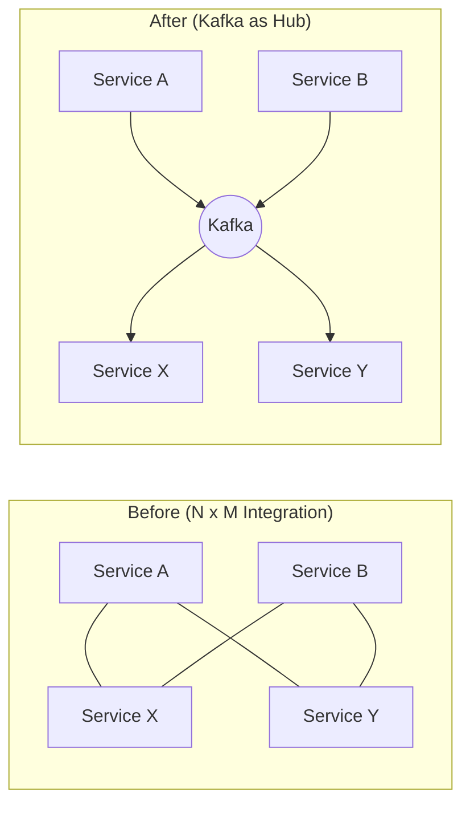
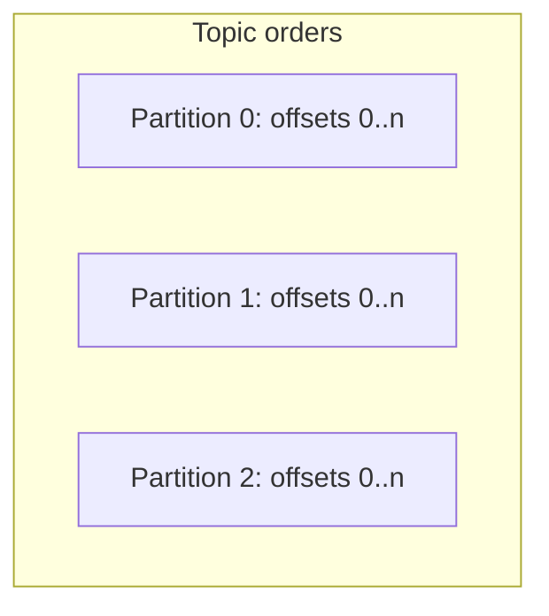
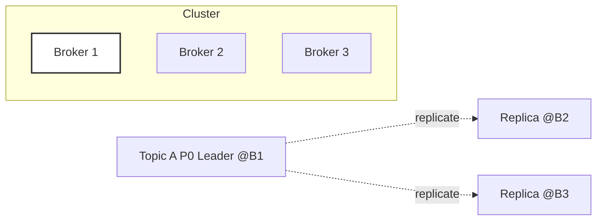
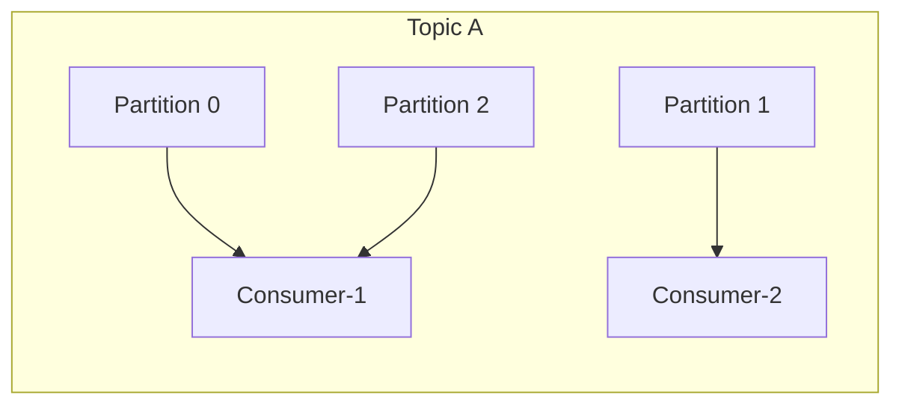
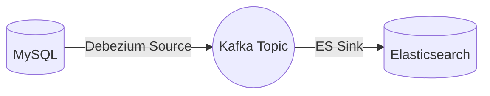

# Apache Kafka — Beginner‑to‑Pro Learning Guide (Bangla + English Terms)

> **উদ্দেশ্য (Goal):** এই README পড়ে একজন Beginner যেন **Kafka**‑র মূল ধারণা, আর্কিটেকচার, অপারেশনস এবং হ্যান্ডস‑অন ল্যাব স্বয়ংসম্পূর্ণভাবে করতে পারে।  
> **কিভাবে পড়বেন:** প্রতিটি সেকশনে আগে **সহজ একটি বাংলা প্যারাগ্রাফ**, তারপর ছোট ডায়াগ্রাম/কোড/ল্যাব।  
> **যাদের জন্য:** DevOps / Backend / Data / Learner — যারা Kafka নতুন করে শিখতে চান বা রিভিশন চান।

---

## Table of Contents
1. [Mental Model: Streams & Log](#1-mental-model-streams--log)
2. [Kafka at a Glance](#2-kafka-at-a-glance)
3. [Core Building Blocks](#3-core-building-blocks)
4. [Topics, Partitions, Offsets, Keys](#4-topics-partitions-offsets-keys)
5. [Producers, Acks, Delivery Semantics](#5-producers-acks-delivery-semantics)
6. [Replication, ISR, Durability](#6-replication-isr-durability)
7. [Consumer Groups, Rebalance, Parallelism](#7-consumer-groups-rebalance-parallelism)
8. [Retention & Log Compaction](#8-retention--log-compaction)
9. [Serialization & Schema Registry (Concept)](#9-serialization--schema-registry-concept)
10. [KRaft vs ZooKeeper](#10-kraft-vs-zookeeper)
11. [Kafka Connect & Kafka Streams (Overview)](#11-kafka-connect--kafka-streams-overview)
12. [Lab Environment: Docker Compose Cluster](#12-lab-environment-docker-compose-cluster)
13. [Observability & Troubleshooting](#13-observability--troubleshooting)
14. [Cheat Sheet](#14-cheat-sheet)
15. [Mini Quiz](#15-mini-quiz)
16. [Glossary](#16-glossary)
17. [Practice Resources (same repo)](#17-practice-resources-same-repo)
18. [Appendix A: Full Docker Compose + .env + Init Script](#appendix-a-full-docker-compose--env--init-script)
19. [Appendix B: kafka1 Service — Line‑by‑Line Explain](#appendix-b-kafka1-service--line-by-line-explain)

---

## 1) Mental Model: Streams & Log
**সহজ কথা:** Kafka‑কে একটা **distributed diary/commit log** ভাবুন, যেখানে প্রত্যেকটা event ক্রমানুসারে লিখে রাখা হয়। যে কেউ পরে এই ডায়েরি থেকে পড়তে পারে এবং যেখানে থেমেছিল সেখান থেকেই শুরু করতে পারে (offset)।



---

## 2) Kafka at a Glance
**সহজ কথা:** আগে সার্ভিসগুলো একে অপরকে সরাসরি ডাকে, তাই কানেকশনের জাল তৈরি হয়। Kafka মাঝখানে **hub/bus** হয়ে সবাইকে আলাদা করে দেয়, ফলে স্কেল করা ও মেইনটেইন করা সহজ হয়।



---

## 3) Core Building Blocks
**সহজ কথা:** Kafka‑তে **Broker** হলো সার্ভার, **Topic** হলো চ্যানেল, **Partition** হলো শার্ড/ভাগ, **Offset** হলো সিরিয়াল নাম্বার, আর **Producer/Consumer** হলো লেখক/পাঠক।

- **Broker:** Kafka server/node; data store + network I/O  
- **Topic:** Logical stream/channel  
- **Partition:** Parallelism + ordering per partition  
- **Offset:** Per‑partition sequential id  
- **Producer/Consumer:** Writer/Reader clients

---

## 4) Topics, Partitions, Offsets, Keys
**সহজ কথা:** একটি Topic অনেকগুলো Partition‑এ ভাগ হয়। **Key** দিলে সেই key‑র মেসেজ সবসময় একই Partition‑এ যাবে, তাই সেই key‑র **ordering** ঠিক থাকে।



**hint:** Key না দিলে producer সাধারণত round‑robin করে, তাই cross‑partition ordering থাকে না।

---

## 5) Producers, Acks, Delivery Semantics
**সহজ কথা:** Producer যখন লেখা শেষ করে, **acks** দিয়ে ঠিক করে কতটা নিরাপদে লিখে শেষ করবে। `acks=all` হলে leader + ISR replicate না হওয়া পর্যন্ত success ধরা হয়।

- **Acks:** `0 | 1 | all(-1)`  
- **Semantics:** At‑most‑once, At‑least‑once, Exactly‑once (idempotent + transactions)

---

## 6) Replication, ISR, Durability
**সহজ কথা:** প্রতিটি Partition‑এর ১টা leader আর কয়েকটা replica থাকে। **ISR** হলো leader‑এর সাথে sync থাকা replicas। Durability বাড়াতে `acks=all` + `min.insync.replicas` ব্যবহার করুন।



---

## 7) Consumer Groups, Rebalance, Parallelism
**সহজ কথা:** একই **group.id**‑এর একাধিক Consumer মিলেই কাজ ভাগাভাগি করে। একটি Partition এক গ্রুপে একবারই পড়া হয়। নতুন Consumer এলে বা কেউ গেলে **rebalance** হয়।



---

## 8) Retention & Log Compaction
**সহজ কথা:** **Retention** পুরনো ডেটা সময়/সাইজ দেখে মুছে দেয়, আর **Compaction** একই key‑র কেবল **শেষের ভার্সন** রেখে বাকিগুলো সরিয়ে দেয়।

- `cleanup.policy=delete` → time/size retention  
- `cleanup.policy=compact` → latest‑per‑key kept

---

## 9) Serialization & Schema Registry (Concept)
**সহজ কথা:** মেসেজকে bytes‑এ রূপান্তর করা/ফিরিয়ে আনা হলো serialization/deserialization। Schema Registry থাকলে Avro/Protobuf JSON‑এর স্কিমা পরিবর্তন **compatible** রাখা যায়।

---

## 10) KRaft vs ZooKeeper
**সহজ কথা:** **KRaft** হলো Kafka‑র নিজের **Raft**‑ভিত্তিক মেটাডেটা কনসেনসাস। তাই আলাদা ZooKeeper লাগেনা; অপারেশন সহজ, লেটেন্সি কম।

- Voters: `"id@host:9093"` তালিকা
- Dev‑এ broker+controller একই process

---

## 11) Kafka Connect & Kafka Streams (Overview)
**সহজ কথা:** **Connect** দিয়ে ডাটাবেস, কিউ, স্টোর থেকে Kafka‑তে আনা/নেওয়া যায় কোড ছাড়া; **Streams** দিয়ে Java‑তে real‑time transform/aggregate করা যায়।



---

## 12) Lab Environment: Docker Compose Cluster
**সহজ কথা:** লোকাল মেশিনে ৩টি broker (KRaft) + Kafka UI দ্রুত চালিয়ে শেখার জন্য এই ল্যাব। `.env`‑এ একটাই cluster id, বাকি সব auto।

### Run
```bash
# ফাইলগুলো repo থেকে নিন: docker-compose.yml, .env, kafka-init.sh
chmod +x kafka-init.sh
docker compose up -d
docker compose ps
# UI: http://localhost:8080
```

### Lab 1: Create Topic, Produce, Consume
```bash
docker compose exec kafka1 kafka-topics.sh \
  --bootstrap-server kafka1:9092 \
  --create --topic demo --partitions 3 --replication-factor 3

docker compose exec -it kafka1 kafka-console-producer.sh \
  --bootstrap-server kafka1:9092 --topic demo

docker compose exec -it kafka2 kafka-console-consumer.sh \
  --bootstrap-server kafka2:9092 --topic demo --from-beginning --timeout-ms 10000
```

### Lab 2: Key-based Partitioning & Ordering
```bash
docker compose exec -it kafka1 bash -lc '
  for i in $(seq 1 10); do echo "user-42:msg-$i"; done | \
  kafka-console-producer.sh --bootstrap-server kafka1:9092 --topic demo \
    --property parse.key=true --property key.separator=":"
'
docker compose exec -it kafka3 kafka-console-consumer.sh \
  --bootstrap-server kafka3:9092 --topic demo --from-beginning \
  --property print.key=true --property key.separator=" | " --timeout-ms 10000
```

### Lab 3: Consumer Groups & Rebalance
```bash
docker compose exec -it kafka1 kafka-console-consumer.sh \
  --bootstrap-server kafka1:9092 --topic demo --group g1 --from-beginning &
docker compose exec -it kafka2 kafka-console-consumer.sh \
  --bootstrap-server kafka2:9092 --topic demo --group g1 --from-beginning &
```

### Lab 4: Durability Drill (acks=all + min.insync.replicas)
```bash
docker compose exec kafka1 kafka-topics.sh \
  --bootstrap-server kafka1:9092 --create --topic strong \
  --partitions 3 --replication-factor 3 \
  --config min.insync.replicas=2

docker compose stop kafka1
docker compose exec kafka2 kafka-metadata-quorum.sh \
  --bootstrap-server kafka2:9092 describe --status
docker compose start kafka1
```

### Lab 5: Retention & Compaction Demo
```bash
docker compose exec kafka1 kafka-topics.sh \
  --bootstrap-server kafka1:9092 --create --topic kv-store \
  --partitions 1 --replication-factor 3 \
  --config cleanup.policy=compact --config min.cleanable.dirty.ratio=0.01
```

---

## 13) Observability & Troubleshooting
**সহজ কথা:** UI দিয়ে topic/partition/lag দেখুন; `docker logs` দিয়ে সমস্যা ধরুন; quorum/advertised.listeners ঠিক আছে কিনা যাচাই করুন।

| Symptom | Why | Quick Fix |
|---|---|---|
| UI connect fails | Brokers not ready / wrong bootstrap | Healthcheck, logs, env |
| Host client fails | EXTERNAL mapping mismatch | `ports` + `ADVERTISED_LISTENERS` ঠিক করুন |
| Quorum warning | Controller down / voters ভুল | Nodes up, voters list ঠিক |
| Duplicates | At‑least‑once path | Idempotent/EOS design |
| Data loss risk | `acks=1` / ISR<min | `acks=all`, `min.insync.replicas>=2` |

---

## 14) Cheat Sheet
```bash
# Topics
kafka-topics.sh --bootstrap-server kafka1:9092 --list
kafka-topics.sh --bootstrap-server kafka1:9092 --create --topic t --partitions 3 --replication-factor 3
kafka-topics.sh --bootstrap-server kafka1:9092 --describe --topic t

# Produce / Consume
kafka-console-producer.sh --bootstrap-server kafka1:9092 --topic t
kafka-console-consumer.sh --bootstrap-server kafka2:9092 --topic t --from-beginning
kafka-console-consumer.sh --bootstrap-server kafka2:9092 --topic t --group g1

# Quorum / Versions
kafka-metadata-quorum.sh --bootstrap-server kafka2:9092 describe --status
kafka-broker-api-versions.sh --bootstrap-server kafka1:9092,kafka2:9092,kafka3:9092
```

---

## 15) Mini Quiz
**সহজ কথা:** নিজের বোঝা যাচাই করতে নীচের প্রশ্নগুলো ট্রাই করুন।

1) Key না দিলে ordering guarantee কোথায় থাকে?  
2) `acks=all` + `min.insync.replicas=2` থাকলে কখন produce fail হওয়া উচিত?  
3) 3 partitions‑এ 5 consumers (same group) দিলে কতজন idle থাকবে এবং কেন?  
4) Compaction আর Retention‑এর মূল পার্থক্য কী?  
5) KRaft voters কেমন ফরম্যাটে দেওয়া হয়?

---

## 16) Glossary
**সহজ কথা:** নতুন টার্মস একসাথে দেখুন ও মনে রাখুন।

- **Broker:** Kafka server instance  
- **Topic/Partition:** Logical stream / shard  
- **Offset:** Per‑partition sequential position  
- **ISR:** In‑Sync Replicas  
- **Rebalance:** Group membership/assignment change  
- **Retention:** Time/size‑based deletion policy  
- **Compaction:** Latest‑per‑key retention  
- **KRaft:** Kafka Raft metadata quorum  
- **EOS:** Exactly‑Once Semantics

---

## 17) Practice Resources (same repo)
**সহজ কথা:** নিচের ফোল্ডারগুলোতে পূর্ণ উদাহরণ/স্ক্রিপ্ট আছে। এগুলো চালিয়ে প্র্যাকটিস করুন।

```
.
├── cluster-setup-docker
│   ├── docker-compose.yml
│   ├── kafka-init.sh
│   └── README.md
├── cluster-setup-VM
│   ├── kafka-net.xml
│   ├── README.md
│   └── Vagrantfile
└── README.md
```

- Docker ল্যাব: [`cluster-setup-docker/docker-compose.yml`](./cluster-setup-docker/docker-compose.yml), [`cluster-setup-docker/kafka-init.sh`](./cluster-setup-docker/kafka-init.sh), [`cluster-setup-docker/README.md`](./cluster-setup-docker/README.md)  
- VM (Vagrant + libvirt) ল্যাব: [`cluster-setup-VM/Vagrantfile`](./cluster-setup-VM/Vagrantfile), [`cluster-setup-VM/kafka-net.xml`](./cluster-setup-VM/kafka-net.xml), [`cluster-setup-VM/README.md`](./cluster-setup-VM/README.md)

---

## Appendix A: Full Docker Compose + .env + Init Script

<details><summary><code>docker-compose.yml</code></summary>

```yaml
version: "3.9"

name: kafka-kraft
services:
  kafka1:
    image: ${KAFKA_IMAGE:-bitnami/kafka:4.0.0}
    container_name: kafka1
    restart: unless-stopped
    env_file: .env
    hostname: kafka1
    volumes:
      - kafka1_data:/bitnami/kafka
    environment:
      KAFKA_ENABLE_KRAFT: "yes"
      KAFKA_KRAFT_CLUSTER_ID: "${KAFKA_KRAFT_CLUSTER_ID:?missing}"
      KAFKA_CFG_PROCESS_ROLES: "broker,controller"
      KAFKA_CFG_NODE_ID: "1"
      KAFKA_CFG_CONTROLLER_QUORUM_VOTERS: "1@kafka1:9093,2@kafka2:9093,3@kafka3:9093"

      KAFKA_CFG_LISTENERS: "PLAINTEXT://:9092,CONTROLLER://:9093,EXTERNAL://:19092"
      KAFKA_CFG_ADVERTISED_LISTENERS: "PLAINTEXT://kafka1:9092,EXTERNAL://localhost:19092"
      KAFKA_CFG_CONTROLLER_LISTENER_NAMES: "CONTROLLER"
      KAFKA_CFG_LISTENER_SECURITY_PROTOCOL_MAP: "PLAINTEXT:PLAINTEXT,CONTROLLER:PLAINTEXT,EXTERNAL:PLAINTEXT"
      KAFKA_CFG_INTER_BROKER_LISTENER_NAME: "PLAINTEXT"

      KAFKA_CFG_LOG_DIRS: "/bitnami/kafka/data"
      KAFKA_CFG_AUTO_CREATE_TOPICS_ENABLE: "${KAFKA_AUTO_CREATE_TOPICS_ENABLE:-false}"
      KAFKA_CFG_DEFAULT_REPLICATION_FACTOR: "3"
      KAFKA_CFG_MIN_INSYNC_REPLICAS: "2"
      KAFKA_CFG_OFFSETS_TOPIC_REPLICATION_FACTOR: "3"
      KAFKA_CFG_TRANSACTION_STATE_LOG_REPLICATION_FACTOR: "3"
      KAFKA_CFG_TRANSACTION_STATE_LOG_MIN_ISR: "2"

      ALLOW_PLAINTEXT_LISTENER: "yes"
      BITNAMI_DEBUG: "${BITNAMI_DEBUG:-no}"
    healthcheck:
      test: ["CMD-SHELL", "/opt/bitnami/kafka/bin/kafka-topics.sh --bootstrap-server localhost:9092 --list >/dev/null 2>&1 || exit 1"]
      interval: 10s
      timeout: 5s
      retries: 20
    ports:
      - "19092:19092"
    networks: [app_net]

  kafka2:
    image: ${KAFKA_IMAGE:-bitnami/kafka:4.0.0}
    container_name: kafka2
    restart: unless-stopped
    env_file: .env
    hostname: kafka2
    volumes:
      - kafka2_data:/bitnami/kafka
    environment:
      KAFKA_ENABLE_KRAFT: "yes"
      KAFKA_KRAFT_CLUSTER_ID: "${KAFKA_KRAFT_CLUSTER_ID:?missing}"
      KAFKA_CFG_PROCESS_ROLES: "broker,controller"
      KAFKA_CFG_NODE_ID: "2"
      KAFKA_CFG_CONTROLLER_QUORUM_VOTERS: "1@kafka1:9093,2@kafka2:9093,3@kafka3:9093"

      KAFKA_CFG_LISTENERS: "PLAINTEXT://:9092,CONTROLLER://:9093,EXTERNAL://:29092"
      KAFKA_CFG_ADVERTISED_LISTENERS: "PLAINTEXT://kafka2:9092,EXTERNAL://localhost:29092"
      KAFKA_CFG_CONTROLLER_LISTENER_NAMES: "CONTROLLER"
      KAFKA_CFG_LISTENER_SECURITY_PROTOCOL_MAP: "PLAINTEXT:PLAINTEXT,CONTROLLER:PLAINTEXT,EXTERNAL:PLAINTEXT"
      KAFKA_CFG_INTER_BROKER_LISTENER_NAME: "PLAINTEXT"

      KAFKA_CFG_LOG_DIRS: "/bitnami/kafka/data"
      KAFKA_CFG_AUTO_CREATE_TOPICS_ENABLE: "${KAFKA_AUTO_CREATE_TOPICS_ENABLE:-false}"
      KAFKA_CFG_DEFAULT_REPLICATION_FACTOR: "3"
      KAFKA_CFG_MIN_INSYNC_REPLICAS: "2"
      KAFKA_CFG_OFFSETS_TOPIC_REPLICATION_FACTOR: "3"
      KAFKA_CFG_TRANSACTION_STATE_LOG_REPLICATION_FACTOR: "3"
      KAFKA_CFG_TRANSACTION_STATE_LOG_MIN_ISR: "2"

      ALLOW_PLAINTEXT_LISTENER: "yes"
      BITNAMI_DEBUG: "${BITNAMI_DEBUG:-no}"
    healthcheck:
      test: ["CMD-SHELL", "/opt/bitnami/kafka/bin/kafka-topics.sh --bootstrap-server localhost:9092 --list >/dev/null 2>&1 || exit 1"]
      interval: 10s
      timeout: 5s
      retries: 20
    ports:
      - "29092:29092"
    networks: [app_net]

  kafka3:
    image: ${KAFKA_IMAGE:-bitnami/kafka:4.0.0}
    container_name: kafka3
    restart: unless-stopped
    env_file: .env
    hostname: kafka3
    volumes:
      - kafka3_data:/bitnami/kafka
    environment:
      KAFKA_ENABLE_KRAFT: "yes"
      KAFKA_KRAFT_CLUSTER_ID: "${KAFKA_KRAFT_CLUSTER_ID:?missing}"
      KAFKA_CFG_PROCESS_ROLES: "broker,controller"
      KAFKA_CFG_NODE_ID: "3"
      KAFKA_CFG_CONTROLLER_QUORUM_VOTERS: "1@kafka1:9093,2@kafka2:9093,3@kafka3:9093"

      KAFKA_CFG_LISTENERS: "PLAINTEXT://:9092,CONTROLLER://:9093,EXTERNAL://:39092"
      KAFKA_CFG_ADVERTISED_LISTENERS: "PLAINTEXT://kafka3:9092,EXTERNAL://localhost:39092"
      KAFKA_CFG_CONTROLLER_LISTENER_NAMES: "CONTROLLER"
      KAFKA_CFG_LISTENER_SECURITY_PROTOCOL_MAP: "PLAINTEXT:PLAINTEXT,CONTROLLER:PLAINTEXT,EXTERNAL:PLAINTEXT"
      KAFKA_CFG_INTER_BROKER_LISTENER_NAME: "PLAINTEXT"

      KAFKA_CFG_LOG_DIRS: "/bitnami/kafka/data"
      KAFKA_CFG_AUTO_CREATE_TOPICS_ENABLE: "${KAFKA_AUTO_CREATE_TOPICS_ENABLE:-false}"
      KAFKA_CFG_DEFAULT_REPLICATION_FACTOR: "3"
      KAFKA_CFG_MIN_INSYNC_REPLICAS: "2"
      KAFKA_CFG_OFFSETS_TOPIC_REPLICATION_FACTOR: "3"
      KAFKA_CFG_TRANSACTION_STATE_LOG_REPLICATION_FACTOR: "3"
      KAFKA_CFG_TRANSACTION_STATE_LOG_MIN_ISR: "2"

      ALLOW_PLAINTEXT_LISTENER: "yes"
      BITNAMI_DEBUG: "${BITNAMI_DEBUG:-no}"
    healthcheck:
      test: ["CMD-SHELL", "/opt/bitnami/kafka/bin/kafka-topics.sh --bootstrap-server localhost:9092 --list >/dev/null 2>&1 || exit 1"]
      interval: 10s
      timeout: 5s
      retries: 20
    ports:
      - "39092:39092"
    networks: [app_net]

  kafka-init:
    image: ${KAFKA_IMAGE:-bitnami/kafka:4.0.0}
    depends_on:
      kafka1: { condition: service_healthy }
      kafka2: { condition: service_healthy }
      kafka3: { condition: service_healthy }
    volumes:
      - ./ops/kafka-init.sh:/usr/local/bin/kafka-init.sh:ro
    command: ["bash","-lc","/usr/local/bin/kafka-init.sh"]
    restart: "no"
    networks: [app_net]

  kafka-ui:
    image: provectuslabs/kafka-ui:latest
    container_name: kafka-ui
    depends_on:
      kafka1: { condition: service_healthy }
      kafka2: { condition: service_healthy }
      kafka3: { condition: service_healthy }
    environment:
      KAFKA_CLUSTERS_0_NAME: local
      KAFKA_CLUSTERS_0_BOOTSTRAPSERVERS: "kafka1:9092,kafka2:9092,kafka3:9092"
    ports:
      - "8080:8080"
    networks: [app_net]

networks:
  app_net:
    name: app_net

volumes:
  kafka1_data:
  kafka2_data:
  kafka3_data:
```
</details>

<details><summary><code>.env</code></summary>

```dotenv
# Image/tag override (optional)
KAFKA_IMAGE=bitnami/kafka:4.0.0
BITNAMI_DEBUG=no

# KRaft cluster id (same for all brokers)
# Generate once:
# docker run --rm bitnami/kafka:4.0.0 bash -lc 'kafka-storage.sh random-uuid'
KAFKA_KRAFT_CLUSTER_ID=pLAs_ZEiQXaMzH08NPNO5g

# Dev-mode convenience
KAFKA_AUTO_CREATE_TOPICS_ENABLE=false
```
</details>

<details><summary><code>ops/kafka-init.sh</code></summary>

```bash
#!/usr/bin/env bash
set -euo pipefail

BS="kafka1:9092"
TOPIC="${KAFKA_BOOTSTRAP_TOPIC:-test-topic}"
PARTS="${KAFKA_BOOTSTRAP_PARTS:-3}"
RF="${KAFKA_BOOTSTRAP_RF:-3}"

echo "[init] creating topic: $TOPIC (partitions=$PARTS, rf=$RF)"
kafka-topics.sh \
  --bootstrap-server "$BS" \
  --create --if-not-exists \
  --topic "$TOPIC" \
  --partitions "$PARTS" \
  --replication-factor "$RF"

echo "[init] listing topics"
kafka-topics.sh --bootstrap-server "$BS" --list

echo "[init] done."
```
</details>

---

## Appendix B: kafka1 Service — Line‑by‑Line Explain
**সহজ কথা:** YAML‑এর প্রতিটি লাইনের কাজ বুঝে নিন, তাহলেই নিজে কনফিগ পাল্টাতে পারবেন।

```yaml
kafka1:
  image: ${KAFKA_IMAGE:-bitnami/kafka:4.0.0}
  container_name: kafka1
  restart: unless-stopped
  env_file: .env
  hostname: kafka1
  volumes:
    - kafka1_data:/bitnami/kafka
  environment:
    KAFKA_ENABLE_KRAFT: "yes"
    KAFKA_KRAFT_CLUSTER_ID: "${KAFKA_KRAFT_CLUSTER_ID:?missing}"
    KAFKA_CFG_PROCESS_ROLES: "broker,controller"
    KAFKA_CFG_NODE_ID: "1"
    KAFKA_CFG_CONTROLLER_QUORUM_VOTERS: "1@kafka1:9093,2@kafka2:9093,3@kafka3:9093"
    KAFKA_CFG_LISTENERS: "PLAINTEXT://:9092,CONTROLLER://:9093,EXTERNAL://:19092"
    KAFKA_CFG_ADVERTISED_LISTENERS: "PLAINTEXT://kafka1:9092,EXTERNAL://localhost:19092"
    KAFKA_CFG_CONTROLLER_LISTENER_NAMES: "CONTROLLER"
    KAFKA_CFG_LISTENER_SECURITY_PROTOCOL_MAP: "PLAINTEXT:PLAINTEXT,CONTROLLER:PLAINTEXT,EXTERNAL:PLAINTEXT"
    KAFKA_CFG_INTER_BROKER_LISTENER_NAME: "PLAINTEXT"
    KAFKA_CFG_LOG_DIRS: "/bitnami/kafka/data"
    KAFKA_CFG_AUTO_CREATE_TOPICS_ENABLE: "${KAFKA_AUTO_CREATE_TOPICS_ENABLE:-false}"
    KAFKA_CFG_DEFAULT_REPLICATION_FACTOR: "3"
    KAFKA_CFG_MIN_INSYNC_REPLICAS: "2"
    KAFKA_CFG_OFFSETS_TOPIC_REPLICATION_FACTOR: "3"
    KAFKA_CFG_TRANSACTION_STATE_LOG_REPLICATION_FACTOR: "3"
    KAFKA_CFG_TRANSACTION_STATE_LOG_MIN_ISR: "2"
    ALLOW_PLAINTEXT_LISTENER: "yes"
    BITNAMI_DEBUG: "${BITNAMI_DEBUG:-no}"
  healthcheck:
    test: ["CMD-SHELL", "kafka-topics.sh --bootstrap-server localhost:9092 --list >/dev/null 2>&1 || exit 1"]
    interval: 10s
    timeout: 5s
    retries: 20
  ports:
    - "19092:19092"
  networks: [app_net]
```

- `image`: কোন Kafka ইমেজ/ভার্সন ব্যবহার হবে (repeatable build).  
- `container_name`: কন্টেইনারের স্থায়ী নাম (logs/exec‑এ সুবিধা).  
- `restart`: Docker daemon উঠলে সার্ভিস অটো‑স্টার্ট (unless‑stopped).  
- `env_file`: `.env` থেকে শেয়ার্ড ভ্যারিয়েবল লোড।  
- `hostname`: নেটওয়ার্কে `kafka1` নামে রেজল্ভ হবে।  
- `volumes`: ডেটা persistent থাকবে (container recreate হলেও).  
- `KAFKA_ENABLE_KRAFT`: KRaft মুড অন (ZooKeeper ছাড়া).  
- `KAFKA_KRAFT_CLUSTER_ID`: একই ক্লাস্টারে যোগ দেওয়ার জন্য কমন UUID।  
- `PROCESS_ROLES`: একই প্রোসেসে broker+controller।  
- `NODE_ID`: ইউনিক নোড আইডি (2/3 অন্য নোডে).  
- `CONTROLLER_QUORUM_VOTERS`: Raft voters তালিকা।  
- `LISTENERS`: অভ্যন্তরীণ ও এক্সটার্নাল লিসেনার binding।  
- `ADVERTISED_LISTENERS`: ক্লায়েন্টদের জন্য সঠিক এন্ডপয়েন্ট।  
- `INTER_BROKER_LISTENER_NAME`: broker↔broker কমিউনিকেশন।  
- `LOG_DIRS`: ডেটা লোকেশন (volume‑mapped).  
- Topic‑related defaults: RF=3, min ISR=2 ইত্যাদি durability‑friendly।  
- `ALLOW_PLAINTEXT_LISTENER`: dev/test‑এ plaintext অনুমতি।  
- `BITNAMI_DEBUG`: verbose লগ।  
- `healthcheck`: ব্রোকার ready না হলে dependent সার্ভিস অপেক্ষা করবে।  
- `ports`: host‑এ EXTERNAL listener expose।  
- `networks`: compose‑managed ব্রিজ নেটওয়ার্ক।

---

## License
MIT (example).

## Maintainer
**Md Jakir Hosen**  
Email: <jakirhosen9395@gmail.com>  
LinkedIn: [hiddenclue0](https://www.linkedin.com/in/hiddenclue0/)
