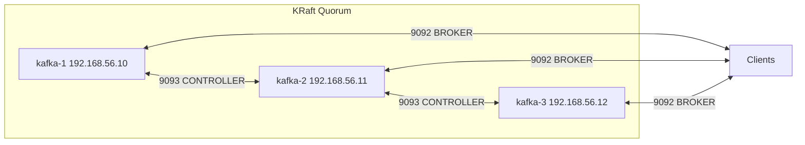

# Apache Kafka KRaft Cluster on Vagrant + KVM/libvirt (Manual, 3 Nodes)

[](https://kafka.apache.org/) [](https://www.scala-lang.org/) [-blue)](https://kafka.apache.org/documentation/#kraft) [](https://github.com/vagrant-libvirt/vagrant-libvirt)


> **Goal:** Vagrant (**libvirt provider**) ব্যবহার করে ৩টি Ubuntu VM-এ **Apache Kafka 4.0.0 (KRaft mode)** ক্লাস্টার ম্যানুয়ালি সেটআপ করা।  
> **IPs:** `192.168.56.10`, `192.168.56.11`, `192.168.56.12`  
> **Provisioner:** None (সবকিছু হাতে করবেন).  
> **Audience:** DevOps / SRE / Learner যারা hands-on ভাবে Kafka cluster build, operate, test করতে চান।

---

## Table of Contents
- [Prerequisites](#prerequisites)
- [Architecture](#architecture)
- [Step 0: Prepare libvirt Network](#step-0-prepare-libvirt-network)
- [Step 1: Create Vagrantfile and Boot VMs](#step-1-create-vagrantfile-and-boot-vms)
- [Step 2: OS and Java on Each VM](#step-2-os-and-java-on-each-vm)
- [Step 3: Install Kafka on Each VM](#step-3-install-kafka-on-each-vm)
- [Step 4: Configure Kafka (KRaft)](#step-4-configure-kafka-kraft)
- [Step 5: Generate Cluster UUID & Format Storage](#step-5-generate-cluster-uuid--format-storage)
- [Step 6: Create systemd Service](#step-6-create-systemd-service)
- [Step 7: Verify the Cluster](#step-7-verify-the-cluster)
- [Step 8: Create Topic and Test](#step-8-create-topic-and-test)
- [Step 9: Cluster Failure Test](#step-9-cluster-failure-test)
- [Troubleshooting (libvirt + Kafka)](#troubleshooting-libvirt--kafka)
- [Ops Cheatsheet](#ops-cheatsheet)
- [Security Hardening (TLS/SASL basics)](#security-hardening-tlssasl-basics)
- [Performance Tuning Quick Wins](#performance-tuning-quick-wins)
- [Metrics & Observability](#metrics--observability)
- [Cleanup & Reset](#cleanup--reset)
- [FAQ](#faq)
- [Glossary](#glossary)
- [Appendix A: server.properties Templates](#appendix-a-serverproperties-templates)

---

## Prerequisites

**Why:** `KVM/libvirt` + `Vagrant` দিয়ে stable VM orchestration দরকার, আর `Kafka` চালাতে `Java` runtime লাগে।  
**What:** হোস্ট মেশিনে নিচের জিনিসগুলো প্রস্তুত রাখুন (Linux host recommended)।  
**How:** এই কমান্ডগুলো দিয়ে যাচাই/ইনস্টল করবেন।

```bash
# CPU virtualization support (vmx/svm)
egrep -c '(vmx|svm)' /proc/cpuinfo  # >=1 হলে OK

# libvirt daemon সক্রিয়
sudo systemctl enable --now libvirtd
sudo systemctl status libvirtd

# Vagrant + libvirt plugin
vagrant plugin install vagrant-libvirt

# প্রয়োজনীয় প্যাকেজ (host)
sudo apt update
sudo apt install -y qemu-kvm libvirt-daemon-system libvirt-clients bridge-utils virt-manager \
                   libxslt-dev libxml2-dev libvirt-dev zlib1g-dev ruby-dev

# গ্রুপ মেম্বারশিপ (logout/login বা newgrp দরকার)
sudo usermod -aG libvirt,kvm $USER
newgrp libvirt

# যাচাই
virsh list --all
```

> **Tip:** BIOS/UEFI-তে virtualization enabled কিনা নিশ্চিত করুন, না হলে `/dev/kvm` অনুপস্থিত থাকবে।

---

## Architecture

**Why:** ৩-node KRaft quorum দিলে **ZooKeeper** ছাড়াই metadata consensus হয়।  
**What:** প্রতিটি node একই `Kafka` binary/config schema, ভিন্ন `node.id` এবং `advertised.listeners`।

| Node    | IP              | Role                     | Ports                             |
|---------|-----------------|--------------------------|-----------------------------------|
| kafka-1 | 192.168.56.10   | Broker + Controller      | 9092 (Broker), 9093 (Controller)  |
| kafka-2 | 192.168.56.11   | Broker + Controller      | 9092, 9093                        |
| kafka-3 | 192.168.56.12   | Broker + Controller      | 9092, 9093                        |



> **Note:** 3-node quorum এ **majority = 2**; এক নোড ডাউন হলেও cluster forward progress রাখে।

---

## Step 0: Prepare libvirt Network

**Why:** default libvirt network সাধারণত `192.168.121.0/24`; আমরা static IP চাই `192.168.56.0/24` এ।  
**What:** `kafka-net` নামে NAT network define করবো যাতে host→guest reachability থাকে।  
**How:** XML create → `virsh net-define` → autostart + start।

Create `kafka-net.xml`:
```xml
<network>
  <name>kafka-net</name>
  <forward mode='nat'/>
  <bridge name='virbr56' stp='on' delay='0'/>
  <ip address='192.168.56.1' netmask='255.255.255.0'>
    <dhcp>
      <range start='192.168.56.100' end='192.168.56.200'/>
    </dhcp>
  </ip>
</network>
```

Commands:
```bash
sudo virsh net-define kafka-net.xml
sudo virsh net-autostart kafka-net
sudo virsh net-start kafka-net
virsh net-list --all
```

> **Note:** আমরা static IP নেব `.10/.11/.12`, যা DHCP range-এর বাইরে, conflict হবে না।

---

## Step 1: Create Vagrantfile and Boot VMs

**Why:** infra-as-code দিয়ে এক কমান্ডে ৩টি VM উঠবে এবং একই কনফিগ শেয়ার করবে।  
**What:** `Vagrantfile` এ `libvirt` provider, `hostname`, `static IP`, `CPU/RAM`।  
**How:** প্রজেক্ট ফোল্ডারে `Vagrantfile` সেভ করে `vagrant up --provider=libvirt` রান।

`Vagrantfile`:
```ruby
# Vagrantfile (libvirt provider)
Vagrant.configure("2") do |config|
  config.vm.box = "bento/ubuntu-24.04"
  config.vm.boot_timeout = 600

  nodes = {
    1 => { name: "kafka-1", ip: "192.168.56.10" },
    2 => { name: "kafka-2", ip: "192.168.56.11" },
    3 => { name: "kafka-3", ip: "192.168.56.12" }
  }

  nodes.each do |id, meta|
    config.vm.define meta[:name] do |node|
      node.vm.hostname = meta[:name]

      node.vm.provider :libvirt do |lv|
        lv.cpus = 2
        lv.memory = 2048
      end

      node.vm.network :private_network,
        ip: meta[:ip],
        libvirt__network_name: "kafka-net"

      node.vm.synced_folder ".", "/vagrant", disabled: true
    end
  end
end
```

Boot:
```bash
vagrant up --provider=libvirt --no-parallel
vagrant status
```

Login:
```bash
vagrant ssh kafka-1
vagrant ssh kafka-2
vagrant ssh kafka-3
```

---

## Step 2: OS and Java on Each VM

```bash
# /etc/hosts
echo "192.168.56.10 kafka-1
192.168.56.11 kafka-2
192.168.56.12 kafka-3" | sudo tee -a /etc/hosts

# Update + Java
sudo apt update
sudo apt install -y openjdk-21-jdk
java -version
```

> **Expected:** `openjdk version "21.0.x"`

---

## Step 3: Install Kafka on Each VM

```bash
# user + dirs
sudo useradd -r -m -d /var/lib/kafka -s /usr/sbin/nologin kafka || true
sudo mkdir -p /opt/kafka /var/lib/kafka/{data,meta,logs}
sudo chown -R kafka:kafka /opt/kafka /var/lib/kafka

# download & install (Kafka 4.0.0)
cd /tmp
curl -LO https://downloads.apache.org/kafka/4.0.0/kafka_2.13-4.0.0.tgz
curl -LO https://downloads.apache.org/kafka/4.0.0/kafka_2.13-4.0.0.tgz.sha512
sha512sum -c kafka_2.13-4.0.0.tgz.sha512

sudo tar -xzf kafka_2.13-4.0.0.tgz -C /opt/kafka --strip-components=1
sudo chown -R kafka:kafka /opt/kafka

# config dir
sudo mkdir -p /etc/kafka
sudo chown -R kafka:kafka /etc/kafka
```

---

## Step 4: Configure Kafka (KRaft)

[Templates for kafka-1/2/3 omitted here for brevity; same as earlier section.]

Quick check:
```bash
grep -E 'node.id|advertised.listeners|controller.quorum.voters' /etc/kafka/server.properties
```

---

## Step 5: Generate Cluster UUID & Format Storage

```bash
sudo -u kafka /opt/kafka/bin/kafka-storage.sh random-uuid
# Example: gd2xrYtZSMyebJWp8r9XqQ

sudo -u kafka /opt/kafka/bin/kafka-storage.sh format -t gd2xrYtZSMyebJWp8r9XqQ -c /etc/kafka/server.properties
```

---

## Step 6: Create systemd Service

```ini
# /etc/systemd/system/kafka.service
[Unit]
Description=Apache Kafka (KRaft)
After=network-online.target
Wants=network-online.target

[Service]
User=kafka
Group=kafka
Environment=KAFKA_HEAP_OPTS=-Xms1g -Xmx1g
Environment=KAFKA_OPTS=
ExecStart=/opt/kafka/bin/kafka-server-start.sh /etc/kafka/server.properties
ExecStop=/opt/kafka/bin/kafka-server-stop.sh
Restart=on-failure
RestartSec=5
LimitNOFILE=100000
WorkingDirectory=/opt/kafka

[Install]
WantedBy=multi-user.target
```

Enable + start:
```bash
sudo systemctl daemon-reload
sudo systemctl enable --now kafka
sudo systemctl status kafka --no-pager
sudo journalctl -u kafka -f
```

---

## Step 7: Verify the Cluster

```bash
/opt/kafka/bin/kafka-metadata-quorum.sh --bootstrap-server kafka-1:9092 describe --status
/opt/kafka/bin/kafka-broker-api-versions.sh --bootstrap-server kafka-1:9092,kafka-2:9092,kafka-3:9092
```

---

## Step 8: Create Topic and Test

```bash
/opt/kafka/bin/kafka-topics.sh --create --topic test-topic --bootstrap-server kafka-1:9092 --partitions 3 --replication-factor 3
/opt/kafka/bin/kafka-topics.sh --bootstrap-server kafka-1:9092 --list
/opt/kafka/bin/kafka-topics.sh --describe --topic test-topic --bootstrap-server kafka-1:9092
/opt/kafka/bin/kafka-console-producer.sh --topic test-topic --bootstrap-server kafka-1:9092
/opt/kafka/bin/kafka-console-consumer.sh --topic test-topic --bootstrap-server kafka-2:9092 --from-beginning
```

---

## Step 9: Cluster Failure Test

```bash
# Stop one VM
vagrant halt kafka-1
# or inside the VM
sudo systemctl stop kafka

# Observe controller re-election
/opt/kafka/bin/kafka-metadata-quorum.sh --bootstrap-server kafka-2:9092 describe --status

# Topic leadership
/opt/kafka/bin/kafka-topics.sh --describe --topic test-topic --bootstrap-server kafka-2:9092

# Bring back
vagrant up kafka-1
sudo systemctl start kafka
sudo systemctl status kafka
```

---

## Troubleshooting (libvirt + Kafka)

| Symptom | Why | Fix |
|---|---|---|
| `-bash: Formatting: command not found` | copy/paste glitch | one-line `format` |
| `kafka.service` not running | heap/port conflict | logs + `lsof`, tune heap |
| Node missing from quorum | name resolution / 9093 issue | `/etc/hosts`, firewall |
| `Optional[test-topic] does not exist` | topic missing / wrong cluster | correct `--bootstrap-server`, create topic |
| Connection cannot be established | broker down or network | service status, routes, firewall |

---

## Ops Cheatsheet

```bash
sudo systemctl {start|stop|restart|status} kafka
sudo journalctl -u kafka -f

/opt/kafka/bin/kafka-metadata-quorum.sh --bootstrap-server kafka-1:9092 describe --status
/opt/kafka/bin/kafka-broker-api-versions.sh --bootstrap-server kafka-1:9092,kafka-2:9092,kafka-3:9092

/opt/kafka/bin/kafka-topics.sh --bootstrap-server kafka-1:9092 --list
/opt/kafka/bin/kafka-topics.sh --bootstrap-server kafka-1:9092 --delete --topic test-topic

/opt/kafka/bin/kafka-consumer-groups.sh --bootstrap-server kafka-1:9092 --list
/opt/kafka/bin/kafka-consumer-groups.sh --bootstrap-server kafka-1:9092 --group my-group --describe
```

---

## Security Hardening (TLS/SASL basics)

(TLS/SASL sample properties as previously provided.)

---

## Performance Tuning Quick Wins

- network/io threads, partitions, min.insync.replicas, GC, OS limits.

---

## Metrics & Observability

- JMX exporter, key MBeans, essential dashboards.

---

## Cleanup & Reset

```bash
sudo systemctl stop kafka
sudo rm -rf /var/lib/kafka/data/* /var/lib/kafka/meta/*
sudo -u kafka /opt/kafka/bin/kafka-storage.sh format -t <UUID> -c /etc/kafka/server.properties
```

---

## FAQ, Glossary, Appendix

- সংক্ষিপ্ত FAQ, glossary, এবং templates refer করুন পূর্ববর্তী সেকশনে।
