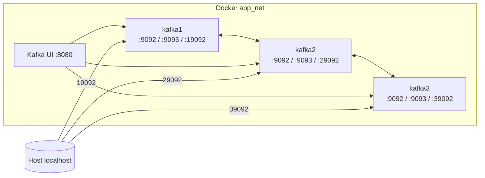
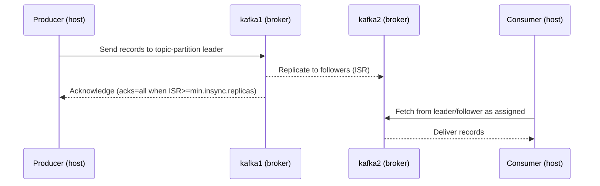

# Kafka KRaft Cluster on Docker Compose (3 Brokers + Kafka UI)

> **Audience:** DevOps / SRE / Learner যারা hands-on ভাবে **Kafka 4.0.0 (KRaft mode)** cluster build, operate, test করতে চান।  
> **Language:** ব্যাখ্যা বাংলা, **technical terms** English.

---

## 0) Overview — *What, Why, How*

**What:**  
Docker Compose ব্যবহার করে 3-broker **Apache Kafka 4.0.0** cluster (KRaft mode: **broker,controller** roles একসাথে) + **Kafka UI**। একক `.env` ফাইলে configurable। Optional **topic initializer** স্ক্রিপ্ট রয়েছে।

**Why:**  
- Local-এ দ্রুত reproducible multi-broker Kafka bring-up।  
- **KRaft** ব্যবহার করে ZooKeeper dependency বাদ।  
- Dev/testing, failover drill, ops practice, CI sandbox-এর জন্য ideal।

**How:**  
- `docker-compose.yml`-এ 3টি Kafka service (`kafka1..3`) + `kafka-ui` + optional `kafka-init`।  
- প্রতিটি broker-এ তিনটি listener: `PLAINTEXT` (9092), `CONTROLLER` (9093), `EXTERNAL` (host access: 19092/29092/39092)।  
- `.env`-এ shared **KRaft cluster id** এবং toggles।

---

## 1) Architecture — *What, Why, How*

**What:**  
3-node **KRaft quorum**: প্রতিটি node same binary, different `node.id` এবং hostname (`kafka1..3`)। UI service: `kafka-ui`.

**Why:**  
- 3-node quorum-এ **majority = 2**; 1 node down হলেও forward progress।  
- `EXTERNAL` listener host-clientsকে **localhost** ports দেয়; **advertised.listeners** mismatch সমস্যা এড়ায়।

**How:**  
- Compose network: `app_net` (bridge).  
- Brokers inter-communicate via `PLAINTEXT://kafkaN:9092` এবং controllers via `CONTROLLER://kafkaN:9093`।  
- Host থেকে apps connect করে `localhost:{19092,29092,39092}`।



**Data Flow (Produce/Consume):**


---

## 2) Prerequisites — *What, Why, How*

**What:** Docker 24+, Compose plugin; 4 CPU, 6–8 GB RAM (dev sizing)।  
**Why:** Multi-broker Kafka + UI stable run করার জন্য যথেষ্ট resources দরকার।  
**How:**

```bash
docker compose version
docker info | grep -E 'Server Version|Cgroup'
```

---

## 3) Repo Structure — *What, Why, How*

**What:**
```
kafka-kraft/
├─ docker-compose.yml
├─ .env
└─ kafka-init.sh
```

**Why:** Separation of concerns: infra (`docker-compose.yml`), configuration (`.env`), and one-time ops (`kafka-init.sh`)।

**How:** ফাইলগুলো নিচে দেওয়া আছে; কপি করে একই structure রাখুন।

---

## 4) Docker Compose — *What, Why, How*

**What:** 3 brokers + UI + optional initializer।  
**Why:** Declarative, reproducible, self-documented bring-up।  
**How:** `docker compose up -d` চালালেই সব services উঠবে।

> **Note:** `bitnami/kafka:4.0.0` tag ব্যবহার করা হয়েছে। registry policy/availability অনুযায়ী প্রয়োজন হলে override করুন (`.env` এর `KAFKA_IMAGE`)।

```yaml
name: kafka-kraft
services:
  kafka1:
    image: ${KAFKA_IMAGE:-bitnami/kafka:4.0.0}
    container_name: kafka1
    restart: unless-stopped
    env_file: .env
    hostname: kafka1
    volumes:
      - kafka1_data:/bitnami/kafka
    environment:
      KAFKA_ENABLE_KRAFT: "yes"
      KAFKA_KRAFT_CLUSTER_ID: "${KAFKA_KRAFT_CLUSTER_ID:?missing}"
      KAFKA_CFG_PROCESS_ROLES: "broker,controller"
      KAFKA_CFG_NODE_ID: "1"
      KAFKA_CFG_CONTROLLER_QUORUM_VOTERS: "1@kafka1:9093,2@kafka2:9093,3@kafka3:9093"

      # listeners: internal broker, controller, and host access per-broker
      KAFKA_CFG_LISTENERS: "PLAINTEXT://:9092,CONTROLLER://:9093,EXTERNAL://:19092"
      KAFKA_CFG_ADVERTISED_LISTENERS: "PLAINTEXT://kafka1:9092,EXTERNAL://localhost:19092"
      KAFKA_CFG_CONTROLLER_LISTENER_NAMES: "CONTROLLER"
      KAFKA_CFG_LISTENER_SECURITY_PROTOCOL_MAP: "PLAINTEXT:PLAINTEXT,CONTROLLER:PLAINTEXT,EXTERNAL:PLAINTEXT"
      KAFKA_CFG_INTER_BROKER_LISTENER_NAME: "PLAINTEXT"

      # storage + defaults
      KAFKA_CFG_LOG_DIRS: "/bitnami/kafka/data"
      KAFKA_CFG_AUTO_CREATE_TOPICS_ENABLE: "${KAFKA_AUTO_CREATE_TOPICS_ENABLE:-false}"
      KAFKA_CFG_DEFAULT_REPLICATION_FACTOR: "3"
      KAFKA_CFG_MIN_INSYNC_REPLICAS: "2"
      KAFKA_CFG_OFFSETS_TOPIC_REPLICATION_FACTOR: "3"
      KAFKA_CFG_TRANSACTION_STATE_LOG_REPLICATION_FACTOR: "3"
      KAFKA_CFG_TRANSACTION_STATE_LOG_MIN_ISR: "2"

      # lab-mode
      ALLOW_PLAINTEXT_LISTENER: "yes"
      BITNAMI_DEBUG: "${BITNAMI_DEBUG:-no}"
    healthcheck:
      test: ["CMD-SHELL", "/opt/bitnami/kafka/bin/kafka-topics.sh --bootstrap-server localhost:9092 --list >/dev/null 2>&1 || exit 1"]
      interval: 10s
      timeout: 5s
      retries: 20
    ports:
      - "19092:19092"   # host access to broker-1 via EXTERNAL
    networks: [app_net]

  kafka2:
    image: ${KAFKA_IMAGE:-bitnami/kafka:4.0.0}
    container_name: kafka2
    restart: unless-stopped
    env_file: .env
    hostname: kafka2
    volumes:
      - kafka2_data:/bitnami/kafka
    environment:
      KAFKA_ENABLE_KRAFT: "yes"
      KAFKA_KRAFT_CLUSTER_ID: "${KAFKA_KRAFT_CLUSTER_ID:?missing}"
      KAFKA_CFG_PROCESS_ROLES: "broker,controller"
      KAFKA_CFG_NODE_ID: "2"
      KAFKA_CFG_CONTROLLER_QUORUM_VOTERS: "1@kafka1:9093,2@kafka2:9093,3@kafka3:9093"

      KAFKA_CFG_LISTENERS: "PLAINTEXT://:9092,CONTROLLER://:9093,EXTERNAL://:29092"
      KAFKA_CFG_ADVERTISED_LISTENERS: "PLAINTEXT://kafka2:9092,EXTERNAL://localhost:29092"
      KAFKA_CFG_CONTROLLER_LISTENER_NAMES: "CONTROLLER"
      KAFKA_CFG_LISTENER_SECURITY_PROTOCOL_MAP: "PLAINTEXT:PLAINTEXT,CONTROLLER:PLAINTEXT,EXTERNAL:PLAINTEXT"
      KAFKA_CFG_INTER_BROKER_LISTENER_NAME: "PLAINTEXT"

      KAFKA_CFG_LOG_DIRS: "/bitnami/kafka/data"
      KAFKA_CFG_AUTO_CREATE_TOPICS_ENABLE: "${KAFKA_AUTO_CREATE_TOPICS_ENABLE:-false}"
      KAFKA_CFG_DEFAULT_REPLICATION_FACTOR: "3"
      KAFKA_CFG_MIN_INSYNC_REPLICAS: "2"
      KAFKA_CFG_OFFSETS_TOPIC_REPLICATION_FACTOR: "3"
      KAFKA_CFG_TRANSACTION_STATE_LOG_REPLICATION_FACTOR: "3"
      KAFKA_CFG_TRANSACTION_STATE_LOG_MIN_ISR: "2"

      ALLOW_PLAINTEXT_LISTENER: "yes"
      BITNAMI_DEBUG: "${BITNAMI_DEBUG:-no}"
    healthcheck:
      test: ["CMD-SHELL", "/opt/bitnami/kafka/bin/kafka-topics.sh --bootstrap-server localhost:9092 --list >/dev/null 2>&1 || exit 1"]
      interval: 10s
      timeout: 5s
      retries: 20
    ports:
      - "29092:29092"
    networks: [app_net]

  kafka3:
    image: ${KAFKA_IMAGE:-bitnami/kafka:4.0.0}
    container_name: kafka3
    restart: unless-stopped
    env_file: .env
    hostname: kafka3
    volumes:
      - kafka3_data:/bitnami/kafka
    environment:
      KAFKA_ENABLE_KRAFT: "yes"
      KAFKA_KRAFT_CLUSTER_ID: "${KAFKA_KRAFT_CLUSTER_ID:?missing}"
      KAFKA_CFG_PROCESS_ROLES: "broker,controller"
      KAFKA_CFG_NODE_ID: "3"
      KAFKA_CFG_CONTROLLER_QUORUM_VOTERS: "1@kafka1:9093,2@kafka2:9093,3@kafka3:9093"

      KAFKA_CFG_LISTENERS: "PLAINTEXT://:9092,CONTROLLER://:9093,EXTERNAL://:39092"
      KAFKA_CFG_ADVERTISED_LISTENERS: "PLAINTEXT://kafka3:9092,EXTERNAL://localhost:39092"
      KAFKA_CFG_CONTROLLER_LISTENER_NAMES: "CONTROLLER"
      KAFKA_CFG_LISTENER_SECURITY_PROTOCOL_MAP: "PLAINTEXT:PLAINTEXT,CONTROLLER:PLAINTEXT,EXTERNAL:PLAINTEXT"
      KAFKA_CFG_INTER_BROKER_LISTENER_NAME: "PLAINTEXT"

      KAFKA_CFG_LOG_DIRS: "/bitnami/kafka/data"
      KAFKA_CFG_AUTO_CREATE_TOPICS_ENABLE: "${KAFKA_AUTO_CREATE_TOPICS_ENABLE:-false}"
      KAFKA_CFG_DEFAULT_REPLICATION_FACTOR: "3"
      KAFKA_CFG_MIN_INSYNC_REPLICAS: "2"
      KAFKA_CFG_OFFSETS_TOPIC_REPLICATION_FACTOR: "3"
      KAFKA_CFG_TRANSACTION_STATE_LOG_REPLICATION_FACTOR: "3"
      KAFKA_CFG_TRANSACTION_STATE_LOG_MIN_ISR: "2"

      ALLOW_PLAINTEXT_LISTENER: "yes"
      BITNAMI_DEBUG: "${BITNAMI_DEBUG:-no}"
    healthcheck:
      test: ["CMD-SHELL", "/opt/bitnami/kafka/bin/kafka-topics.sh --bootstrap-server localhost:9092 --list >/dev/null 2>&1 || exit 1"]
      interval: 10s
      timeout: 5s
      retries: 20
    ports:
      - "39092:39092"
    networks: [app_net]

  # optional: one-shot initializer for topics/users etc.
  kafka-init:
    image: ${KAFKA_IMAGE:-bitnami/kafka:4.0.0}
    depends_on:
      kafka1: { condition: service_healthy }
      kafka2: { condition: service_healthy }
      kafka3: { condition: service_healthy }
    volumes:
      - ./kafka-init.sh:/usr/local/bin/kafka-init.sh:ro
    command: ["bash","-lc","/usr/local/bin/kafka-init.sh"]
    restart: "no"
    networks: [app_net]

  # UI
  kafka-ui:
    image: provectuslabs/kafka-ui:latest
    container_name: kafka-ui
    depends_on:
      kafka1: { condition: service_healthy }
      kafka2: { condition: service_healthy }
      kafka3: { condition: service_healthy }
    environment:
      KAFKA_CLUSTERS_0_NAME: local
      KAFKA_CLUSTERS_0_BOOTSTRAPSERVERS: "kafka1:9092,kafka2:9092,kafka3:9092"
      # If you want read-only UI:
      # KAFKA_CLUSTERS_0_READONLY: "true"
    ports:
      - "8080:8080"
    networks: [app_net]

networks:
  app_net:
    name: app_net

volumes:
  kafka1_data:
  kafka2_data:
  kafka3_data:


```

---

## 5) `.env` — *What, Why, How*

**What:** Shared configuration values।  
**Why:** Image tag override ও single-source-of-truth KRaft cluster id।  
**How:** নিচের মতো `.env` সেভ করুন।

```dotenv
KAFKA_IMAGE=bitnami/kafka:4.0.0
BITNAMI_DEBUG=no

# ------- KRaft cluster id (same for all brokers) -------
# Generate once:
# docker run --rm ${KAFKA_IMAGE} bash -lc 'kafka-storage.sh random-uuid'
KAFKA_KRAFT_CLUSTER_ID=pLAs_ZEiQXaMzH08NPNO5g


# ------- Topic autocreate (dev only) -------
KAFKA_AUTO_CREATE_TOPICS_ENABLE=false

```

---

## 6) `ops/kafka-init.sh` — *What, Why, How*

**What:** One-shot topic initializer।  
**Why:** Bring-up শেষে default topic create করে দ্রুত verify/test করতে।  
**How:**

```bash
#!/usr/bin/env bash
set -euo pipefail

BS="kafka1:9092"
TOPIC="${KAFKA_BOOTSTRAP_TOPIC:-test-topic}"
PARTS="${KAFKA_BOOTSTRAP_PARTS:-3}"
RF="${KAFKA_BOOTSTRAP_RF:-3}"

echo "[init] creating topic: $TOPIC (partitions=$PARTS, rf=$RF)"
/opt/bitnami/kafka/bin/kafka-topics.sh \
  --bootstrap-server "$BS" \
  --create --if-not-exists \
  --topic "$TOPIC" \
  --partitions "$PARTS" \
  --replication-factor "$RF"

echo "[init] listing topics"
/opt/bitnami/kafka/bin/kafka-topics.sh --bootstrap-server "$BS" --list

echo "[init] done."

```

---

## 7) Run & Verify — *What, Why, How*

**What:** Bring-up, logs, UI, quick sanity।  
**Why:** Cluster readiness এবং connectivity নিশ্চিত করা।  
**How:**

```bash
# First-time
chmod +x kafka-init.sh

docker compose up -d
docker compose ps
docker logs -f kafka1
```

**Kafka UI:** http://localhost:8080

Quick checks:
```bash
# API versions
docker compose exec kafka1 /opt/bitnami/kafka/bin/kafka-broker-api-versions.sh \
  --bootstrap-server kafka1:9092,kafka2:9092,kafka3:9092

# Create topic (if init script off)
docker compose exec kafka1 /opt/bitnami/kafka/bin/kafka-topics.sh \
  --bootstrap-server kafka1:9092 \
  --create --topic demo --partitions 3 --replication-factor 3

# Produce
docker compose exec -it kafka1 /opt/bitnami/kafka/bin/kafka-console-producer.sh \
  --bootstrap-server kafka1:9092 --topic demo

# Consume
docker compose exec -it kafka2 /opt/bitnami/kafka/bin/kafka-console-consumer.sh \
  --bootstrap-server kafka2:9092 --topic demo --from-beginning --timeout-ms 10000
```

---

## 8) Exposed Ports — *What, Why, How*

**What:** Host-এ যে ports খোলা।  
**Why:** Host apps থেকে broker-এ connect করার জন্য।  
**How:** নিচের mapping ব্যবহার করুন।

| Service | Host Port | Container Port | Purpose |
|---|---:|---:|---|
| kafka1 | 19092 | 19092 | EXTERNAL listener (host access) |
| kafka2 | 29092 | 29092 | EXTERNAL listener (host access) |
| kafka3 | 39092 | 39092 | EXTERNAL listener (host access) |
| kafka-ui | 8080 | 8080 | Web UI |

> Container network-এর ভিতর সবসময় `kafkaN:9092` ব্যবহার করুন। Host apps-এর জন্য `localhost:{19092,29092,39092}`।

---

## 9) Failure Test — *What, Why, How*

**What:** এক broker down করে quorum behavior দেখা।  
**Why:** Operational confidence এবং recovery behavior বোঝা।  
**How:**

```bash
docker compose stop kafka1

docker compose exec kafka2 /opt/bitnami/kafka/bin/kafka-metadata-quorum.sh \
  --bootstrap-server kafka2:9092 describe --status

docker compose start kafka1
```

---

## 10) Line‑by‑Line Explain: `kafka1` Service

> লক্ষ্য: প্রতিটি লাইন কী করে সেটা পরিষ্কার বোঝা।

```yaml
kafka1:
  image: ${KAFKA_IMAGE:-bitnami/kafka:4.0.0}
```
- **What:** Kafka container image।  
- **Why:** নির্দিষ্ট Kafka version pull/run করতে।  
- **How:** `.env`-এ `KAFKA_IMAGE` দিলে তা নেবে; না দিলে fallback `bitnami/kafka:4.0.0`।

```yaml
  container_name: kafka1
```
- **What:** Docker container name।  
- **Why:** `docker logs/exec` করতে সহজ হয়।  
- **How:** Static name set।

```yaml
  restart: unless-stopped
```
- **What:** Restart policy।  
- **Why:** daemon reboot হলে service নিজে উঠবে।  
- **How:** user manually `stop` দিলে আর উঠবে না।

```yaml
  env_file: .env
```
- **What:** Environment variables externalize।  
- **Why:** একই values সব services share/override।  
- **How:** `.env` load হয় runtime-এ।

```yaml
  hostname: kafka1
```
- **What:** Container hostname/DNS label।  
- **Why:** Compose network-এ `kafka1` নামে resolve হয়।  
- **How:** internal DNS mapping।

```yaml
  volumes:
    - kafka1_data:/bitnami/kafka
```
- **What:** Persistent volume।  
- **Why:** broker logs/data container lifecycle ছাড়িয়ে preserve।  
- **How:** Named volume bind to `/bitnami/kafka`।

```yaml
  environment:
    KAFKA_ENABLE_KRAFT: "yes"
```
- **What:** KRaft mode enable।  
- **Why:** ZooKeeper dependency ছাড়াই metadata quorum।  
- **How:** Bitnami entrypoint এই flag detect করে proper config জেনারেট করে।

```yaml
    KAFKA_KRAFT_CLUSTER_ID: "${KAFKA_KRAFT_CLUSTER_ID:?missing}"
```
- **What:** Cluster-wide UUID।  
- **Why:** একই id না হলে brokers একই cluster-এ যোগ হবে না।  
- **How:** `.env` থেকে required; না থাকলে compose error (`:?missing`)।

```yaml
    KAFKA_CFG_PROCESS_ROLES: "broker,controller"
```
- **What:** একই process-এ broker এবং controller।  
- **Why:** ছোট cluster/dev setup simple রাখা।  
- **How:** Kafka server properties-এ translate হয়।

```yaml
    KAFKA_CFG_NODE_ID: "1"
```
- **What:** numeric node id।  
- **Why:** quorum-এ uniqueness, metric labeling।  
- **How:** প্রতিটি broker-এ আলাদা (`2`,`3`)।

```yaml
    KAFKA_CFG_CONTROLLER_QUORUM_VOTERS: "1@kafka1:9093,2@kafka2:9093,3@kafka3:9093"
```
- **What:** controller quorum voter list।  
- **Why:** leader election, metadata consensus।  
- **How:** `nodeId@host:controllerPort` triplets।

```yaml
    KAFKA_CFG_LISTENERS: "PLAINTEXT://:9092,CONTROLLER://:9093,EXTERNAL://:19092"
```
- **What:** listeners bind।  
- **Why:** তিন রকম traffic isolate: broker, controller, host-exposed।  
- **How:** container ports open: 9092, 9093, 19092।

```yaml
    KAFKA_CFG_ADVERTISED_LISTENERS: "PLAINTEXT://kafka1:9092,EXTERNAL://localhost:19092"
```
- **What:** clients-এর জন্য advertised endpoints।  
- **Why:** container-ভিতর ক্লায়েন্ট `kafka1:9092`, host ক্লায়েন্ট `localhost:19092`।  
- **How:** client metadata-এ এই addresses propagate হয়।

```yaml
    KAFKA_CFG_CONTROLLER_LISTENER_NAMES: "CONTROLLER"
```
- **What:** কোন listener controller traffic নেবে।  
- **Why:** separation/clarity।  
- **How:** Kafka internal binding।

```yaml
    KAFKA_CFG_LISTENER_SECURITY_PROTOCOL_MAP: "PLAINTEXT:PLAINTEXT,CONTROLLER:PLAINTEXT,EXTERNAL:PLAINTEXT"
```
- **What:** প্রতিটি listener-এর security protocol।  
- **Why:** Dev simplicity; prod-এ `SSL`/`SASL_SSL` দিন।  
- **How:** server.properties mapping।

```yaml
    KAFKA_CFG_INTER_BROKER_LISTENER_NAME: "PLAINTEXT"
```
- **What:** inter-broker comms কোন listener-এ হবে।  
- **Why:** consistent internal routing।  
- **How:** brokers একে অপরকে `PLAINTEXT://kafkaN:9092` ধরে।

```yaml
    KAFKA_CFG_LOG_DIRS: "/bitnami/kafka/data"
```
- **What:** Kafka log/data path।  
- **Why:** volumes-এ persist।  
- **How:** filesystem path।

```yaml
    KAFKA_CFG_AUTO_CREATE_TOPICS_ENABLE: "${KAFKA_AUTO_CREATE_TOPICS_ENABLE:-false}"
    KAFKA_CFG_DEFAULT_REPLICATION_FACTOR: "3"
    KAFKA_CFG_MIN_INSYNC_REPLICAS: "2"
    KAFKA_CFG_OFFSETS_TOPIC_REPLICATION_FACTOR: "3"
    KAFKA_CFG_TRANSACTION_STATE_LOG_REPLICATION_FACTOR: "3"
    KAFKA_CFG_TRANSACTION_STATE_LOG_MIN_ISR: "2"
```
- **What:** sensible defaults for 3-broker।  
- **Why:** resilience (RF=3, min ISR=2), predictable behavior।  
- **How:** topic-level ও internal log configs।

```yaml
    ALLOW_PLAINTEXT_LISTENER: "yes"
```
- **What:** Bitnami guard bypass।  
- **Why:** Dev/test convenience।  
- **How:** entrypoint check।

```yaml
    BITNAMI_DEBUG: "${BITNAMI_DEBUG:-no}"
```
- **What:** verbose logs।  
- **Why:** troubleshooting ease।  
- **How:** entrypoint toggles।

```yaml
  healthcheck:
    test: ["CMD-SHELL", "/opt/bitnami/kafka/bin/kafka-topics.sh --bootstrap-server localhost:9092 --list >/dev/null 2>&1 || exit 1"]
    interval: 10s
    timeout: 5s
    retries: 20
```
- **What:** broker readiness probe।  
- **Why:** dependent services only start when broker responsive।  
- **How:** simple `topics --list` cmd success হলে healthy।

```yaml
  ports:
    - "19092:19092"
```
- **What:** host port mapping।  
- **Why:** host client থেকে direct connect।  
- **How:** `EXTERNAL` listener expose।

```yaml
  networks: [app_net]
```
- **What:** custom bridge network।  
- **Why:** DNS by service name, isolated traffic।  
- **How:** compose-managed network।

---

## 11) Ops Cheatsheet — *What, Why, How*

**What:** Frequent ops commands।  
**Why:** দ্রুত debug/operate।  
**How:**

```bash
# Status & logs
docker compose ps
docker logs -f kafka1

# Topics
docker compose exec kafka1 /opt/bitnami/kafka/bin/kafka-topics.sh --bootstrap-server kafka1:9092 --list
docker compose exec kafka1 /opt/bitnami/kafka/bin/kafka-topics.sh --bootstrap-server kafka1:9092 \
  --create --topic foo --partitions 3 --replication-factor 3
docker compose exec kafka1 /opt/bitnami/kafka/bin/kafka-topics.sh --bootstrap-server kafka1:9092 \
  --describe --topic foo

# Consumer groups
docker compose exec kafka1 /opt/bitnami/kafka/bin/kafka-consumer-groups.sh --bootstrap-server kafka1:9092 --list
docker compose exec kafka1 /opt/bitnami/kafka/bin/kafka-consumer-groups.sh --bootstrap-server kafka1:9092 --group my-group --describe
```

---

## 12) Troubleshooting — *What, Why, How*

| Symptom | Why | How (Fix) |
|---|---|---|
| `kafka1` unhealthy | wrong advertised listeners, port bind সমস্যা | `docker logs kafka1`, `env` dump, `server.properties` inspect |
| UI connect করে না | brokers ready নয় | `depends_on` OK? `kafka-topics --list` works? |
| Host থেকে client connect ফেল | EXTERNAL mapping/adverts mismatch | `ports` ও `ADVERTISED_LISTENERS` ঠিক করুন |
| quorum unavailable | broker/controller down | `kafka-metadata-quorum.sh --describe --status` |
| unexpected autocreate | autocreate true | `.env: KAFKA_AUTO_CREATE_TOPICS_ENABLE=false` |

Useful snippets:
```bash
docker exec -it kafka1 env | sort
docker exec -it kafka1 sh -lc 'grep -v "^[#;]" /opt/bitnami/kafka/config/server.properties || true'
```

---

## 13) Security Hardening — *What, Why, How*

**What:** TLS/SASL, ACLs, network hygiene।  
**Why:** PLAINTEXT dev-only; prod-এ encryption/authz দরকার।  
**How:**
- Listeners: `SSL`/`SASL_SSL`; certs mount করে `KAFKA_CFG_LISTENER_SECURITY_PROTOCOL_MAP` আপডেট।  
- Auth: SASL/SCRAM বা mTLS।  
- AuthZ: `authorizer.class.name` এবং ACLs।  
- Secrets: `.env` নয়; Docker secrets/Vault ব্যবহার করুন।  
- Network: শুধুমাত্র প্রয়োজনীয় host ports expose।

---

## 14) Scaling & Performance — *What, Why, How*

**What:** brokers বাড়ানো, throughput tuning।  
**Why:** workload বাড়লে stability/latency/throughput বজায় রাখতে।  
**How:**
- Scale: নতুন service ব্লক কপি; unique `NODE_ID`, ports, volume। `CONTROLLER_QUORUM_VOTERS` update।  
- Config: `num.network.threads`, `num.io.threads`, `num.partitions`, `socket.*.buffer.bytes` workload অনুযায়ী।  
- Storage: SSD, `log.retention.*`, `log.segment.bytes`, `log.cleaner.*` tune।  
- JVM: `KAFKA_HEAP_OPTS=-Xms1g -Xmx1g` env দিয়ে সেট করুন।

---

## 15) Cleanup / Reset — *What, Why, How*

**What:** bring-down এবং data reset।  
**Why:** clean slate test/run।  
**How:**
```bash
docker compose down
docker volume rm kafka-kraft_kafka1_data kafka-kraft_kafka2_data kafka-kraft_kafka3_data
# অথবা সব volumes clean:
# docker volume prune
```

---

## 16) FAQ — *What, Why, How*

**Q1. Host apps কোন bootstrap দেব?**  
- **What:** host থেকে brokers connect।  
- **Why:** advertised EXTERNAL endpoints।  
- **How:** `localhost:19092,localhost:29092,localhost:39092`।

**Q2. Container-এর ভিতর থেকে?**  
- **How:** `kafka1:9092,kafka2:9092,kafka3:9092`।

**Q3. `.env` ছাড়া চলবে?**  
- **Why:** cluster id দরকার।  
- **How:** `.env`-এ `KAFKA_KRAFT_CLUSTER_ID` না থাকলে compose fail হয়।

**Q4. Single-broker dev-only?**  
- **How:** `kafka2`,`kafka3` কমেন্ট করুন; RF/ISR 1 করুন।

---

**License:** MIT (example; প্রয়োজনমতো নির্ধারণ করুন).  
**Maintainer:** আপনার নাম/ইমেইল
